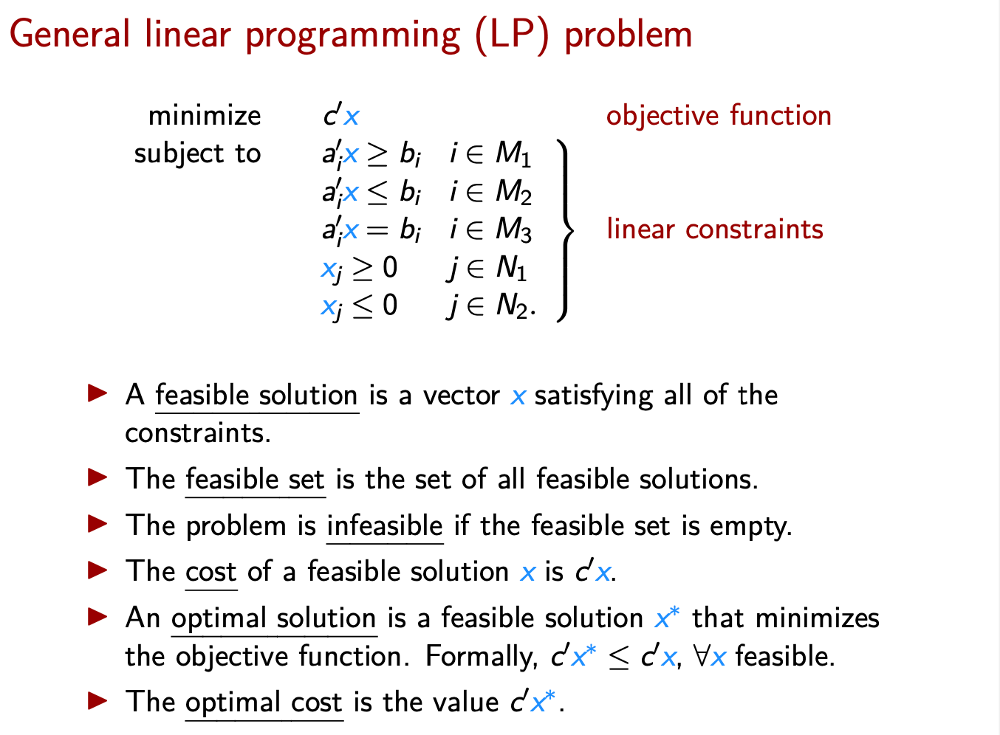
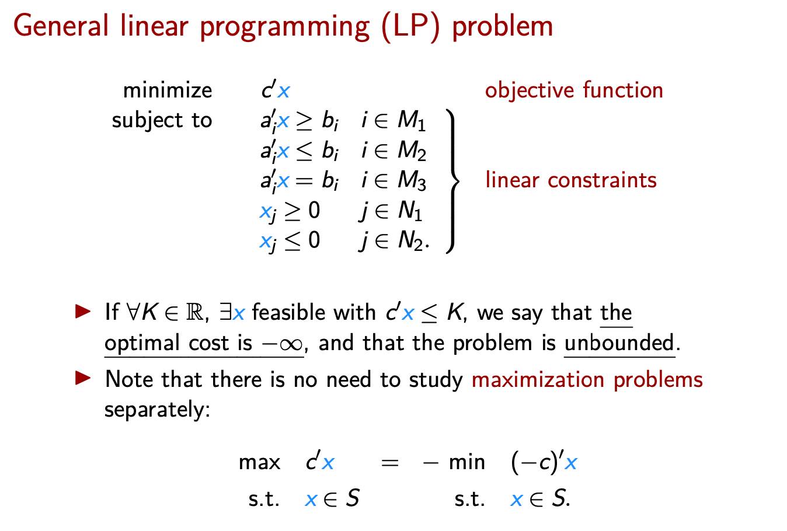

# Optimization 

## Linear Functions

A function $f: \mathbb{R}^n \rightarrow \mathbb{R}$ is linear if:
1. $f(x+y)=f(x)+f(y) \quad \forall x, y \in \mathbb{R}^n$
2. $f(\lambda x)=\lambda f(x) \quad \forall x \in \mathbb{R}^n, \forall \lambda \in \mathbb{R}$
Equivalently, $f$ is linear if it can be written as:
$$
c^{\prime} x=\sum_{i=1}^n c_i x_i=c_1 x_1+c_2 x_2+\cdots+c_n x_n
$$
where $c_1, c_2, \ldots, c_n$ are real numbers.

## Linear Optimization

### Examples

$$\begin{array}{cll}\min & c^{\prime} x \quad \text { LINEAR objective function } \\
 \text { s.t. } & a_i^{\prime} x \geq b_i \quad i \in M_1 \\
& a_i^{\prime} x \leq b_i \quad i \in M_2 \quad \text { LINEAR inequalities } \\
& a_i^{\prime} x=b_i \quad i \in M_3\end{array}$$

$$
\begin{aligned}
\operatorname{minimize}\ & 2 x_1-x_2+4 x_3 \\
\text { subject to } & x_1+x_2+x_4 \leq 2 \\
& 3 x_2-x_3=5 \\
& x_3+x_4 \geq 3 \\
& x_1 \geq 0 \\
& x_3 \leq 0
\end{aligned}
$$
Strict inequalities like $x_3+x_4>3$ are not allowed!

- optimality conditions
- duality

## Course Overview

### Textbook
Introduction to Linear Optimization,
by Dimitris Bertsimas and John N.
Tsitsiklis (1997).

### Topics

- Ch. 1: Introduction $\S 1.1-1.4$\
The LP problem and examples.
- Ch. 2: The geometry of linear programming §2.1-2.8\
Polyhedra and their geometric and algebraic properties.
- Ch. 3: The simplex method §3.1-3.7 and 1.6\
The main method used to solve LP problems.
- Ch. 4: Duality theory $\S 4.1-4.6$\
A new LP problem and its relation with the original one.
- Ch. 7: Network flow problems §7.1-7.3\
Solving network flow problems with the simplex algorithm.
- Ch. 8: Complexity of linear programming and the ellipsoid method $\S 8.1-8.5$\
The first polynomial time algorithm for LP problems.

## Introduction

